Bogotá, May 3, 2024

Good morning, my name is Jorge Jaramillo (www.linkedin.com/in/jorgeivanjh).

This is a sales unit estimation model for each product and each day of the year. This model will help plan the frequency and volume of necessary purchases to ensure the availability of required products without incurring stockouts or overstocking.

# DATASET

The dataset integrates sales information and product attributes for the dates between 01/01/2020 and 11/30/2022.

Files:
- The dataset "catalogo_productos.csv" contains the characteristics of all products, such as size, category, supplier, among others. The primary key in this dataset is "id_producto".
- The dataset "demanda.csv" will be used to build a predictive model that estimates daily sales per product. The data covers from 01/01/2020 to 11/30/2022. This dataset provides information on daily demand by date and "id_producto".
- The dataset "demanda_test.csv" will be used to apply the built model and evaluate its out-of-sample accuracy. The data covers the period from 12/01/2022 to 02/28/2023. This dataset contains two columns: date and "id_producto".

Variables:
- date: the time when the event occurs.
- id_producto: product identifier number.
- category: corresponds to the product category.
- sub_category: takes values of subcategories from the category field.
- size: takes the following values (small, medium, large).
- premium: dummy variable. 0 is not premium and 1 is premium.
- exclusive_brand: dummy variable. 0 is not exclusive and 1 is exclusive.
- seasonal: dummy variable that identifies if the product is sold all year round or not. It is 1 for products sold only in November, December, and January, and 0 if sold all year round.
- supplier_nit: supplier identification code.
- demand: variable to predict. Indicates the units sold for each day and each product.

# WORK ENVIRONMENT

I started by creating a virtual environment in Conda exclusively for this project, keeping a careful track of the required library versions. I also created a .git and a PRIVATE repository on GitHub, ensuring to include the data paths and the confidential information PDF in the .gitignore for easy tracking of progress.

If you cloned the repository and want to recreate the virtual environment used for this project, run the following commands at the project root, where you will find the environment.yml file:

```
conda env create -f environment.yml
conda activate stock_prediction
```

If you need to add or update library versions, do so in the environment.yml and run:

```
conda env update -n stock_prediction -f environment.yml --prune
```

# PREPROCESSING

The analysis began by importing the available information and converting it to DataFrames using Pandas. Then, I started a process of data verification and cleaning. After verifying that there were no outliers, I determined the amount of missing data in the tables, finding gaps mainly in the catalogo_productos.csv information, where:

- 32 missing values in the "sub_category" variable.
- 5 missing values in the "premium" variable.
- 3 missing values in the "size" variable.
- 1 missing value in the "supplier_nit" variable.

After ruling out direct access to the data source and imputation methods suitable for numerical variables, an analysis was carried out to impute the most appropriate values. The analysis was as follows:

"For each category and size of the missing records, a comparison was made of the subcategory, premium status, and size with the non-missing records of similar categories, filling the gaps accordingly."

For example:

Category "soaps", "Antibacterial" contrasted with "premium" values of categories "shampoos" and "cleaning" -> Most with premium value == 0.0, therefore in category "soaps", premium value = 0.

After this, the type and format of the data were reviewed, making the following modifications:

- category changed from string to non-ordinal category.
- sub_category changed from string to non-ordinal category, and the text format was changed to snake casing to match the category format.
- size changed from string to ordinal category: 'small' < 'medium' < 'large'.
- premium changed from float to boolean.
- exclusive_brand changed from int to boolean.
- seasonal changed from int to boolean.

Then, a boolean variable called "after_competition" was added, which indicates the records of dates after the competition arrived on July 2, 2021. The "supplier_nit" column was also removed as it contained the same value for all records and did not provide any significant value.

After verifying the data up to this point, a left join was performed on the product information in "catalogo_productos.csv" with the temporal records in "demanda.csv" and "demanda_test.csv".

# EDA

The exploratory data analysis began by making a generalized comparison of the demand 1 year before (blue) and 1 year after (orange) the competition arrived on July 2, 2021 (red). A line graph was used to show the 30-day moving average of daily demands for all products.

At first glance, a downward trend in product demand is observed since the competition arrived.

Note: the 30-day moving average was plotted to visualize the demand pattern over time more easily.

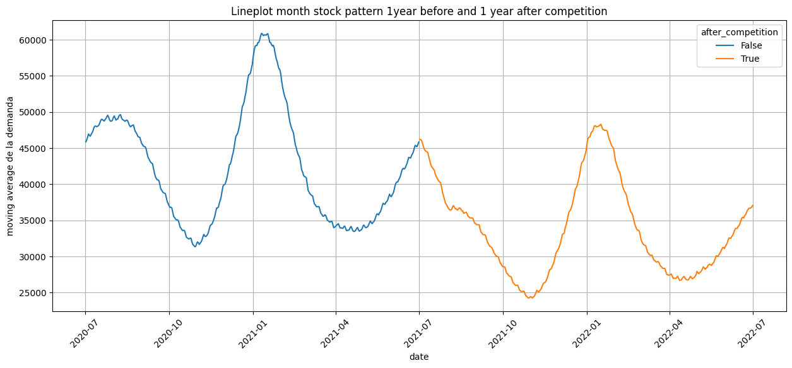

To better illustrate this difference, quartiles 1, 2, and 3 were calculated, and a box plot was created, showing a significant decrease in sales since the competitor arrived.

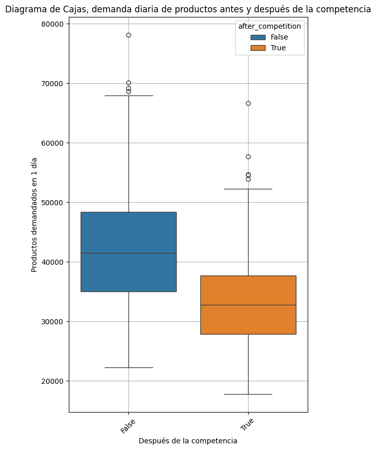

To verify that this difference is statistically significant, a t-test was performed on product demand before and after July 2, 2021, taking:

- Null hypothesis (H0): there is no difference in demand before and after the competition arrived.
- Alternative hypothesis (Ha): there is a significant difference in demand before and after the competition arrived.

```
TtestResult(statistic=13.918088276062297, pvalue=3.237331780181677e-39, df=728.0)
```

The result was a p-value much lower than 0.05, so the null hypothesis is rejected, and it is concluded that the difference is significant, corresponding to a loss of around 41504.0-32768.0 = 8736 products daily in the median.

A second box plot was added, showing the number of sales before and after the competition arrived.

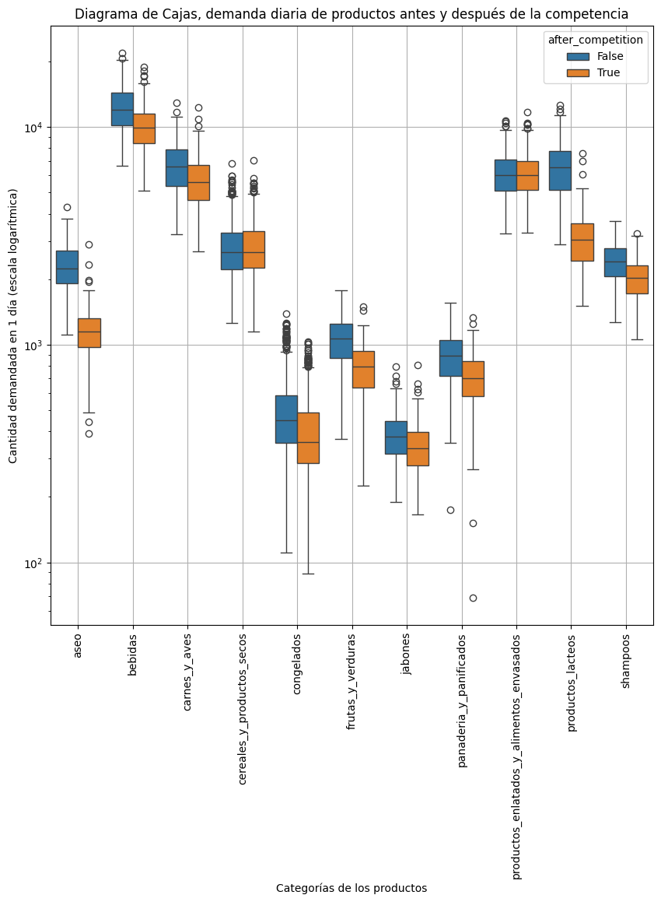

Along with the calculation of the difference in the median sales before and after the competition arrived.

```
category
dairy_products                            3472.0
beverages                                 2042.0
cleaning                                  1098.0
meat_and_poultry                          1016.0
shampoos                                   382.0
fruits_and_vegetables                      272.0
bakery_and_baked_goods                     185.0
frozen_goods                                93.0
soaps                                       44.0
cereals_and_dry_goods                        4.0
canned_and_packaged_foods                  -36.0
dtype: float64
```

The products that lost the most demand were:

1st dairy_products, with a difference of 3472 units.
2nd beverages, with a difference of 2042 units.
3rd cleaning, with a difference of 1097 units.
4th meat_and_poultry, with a difference of 1016 units.

A bar chart was created, organizing the categories in ascending order according to the percentage of sales lost after July 2, 2021. The percentage is shown in red.

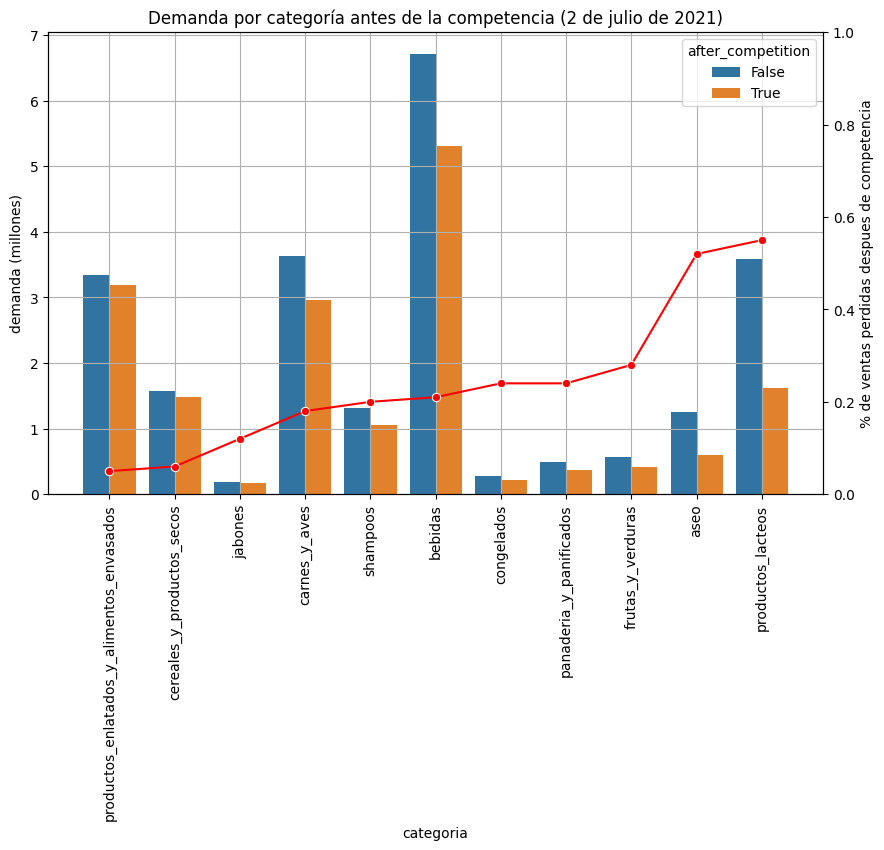

The percentage of losses for each category were:

```
| category                          | percent_dec_after |
|------------------------------------|-------------------|
| canned_and_packaged_foods          | 0.04              |
| cereals_and_dry_goods              | 0.05              |
| soaps                              | 0.11              |
| meat_and_poultry                   | 0.17              |
| shampoos                           | 0.19              |
| beverages                          | 0.20              |
| frozen_goods                       | 0.23              |
| bakery_and_baked_goods             | 0.23              |
| fruits_and_vegetables              | 0.27              |
| cleaning                           | 0.51              |
| dairy_products                     | 0.54              |
```

To perform a detailed exploration of sales patterns, the functions lineplot_movingaverage_pattern, barplot_month_pattern, and lineplot_weekday_pattern were created. These functions allow analyzing the demand patterns of any desired product within the data.

Using these functions, graphs were created that show interesting patterns regarding the impact of competition on dairy product demand. For the product with id==23 (yogurt) and the entire "milk" subcategory, the effect on sales reduction since the competition arrived on July 2, 2021, is observed.

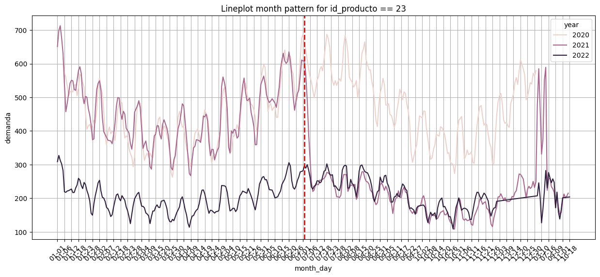
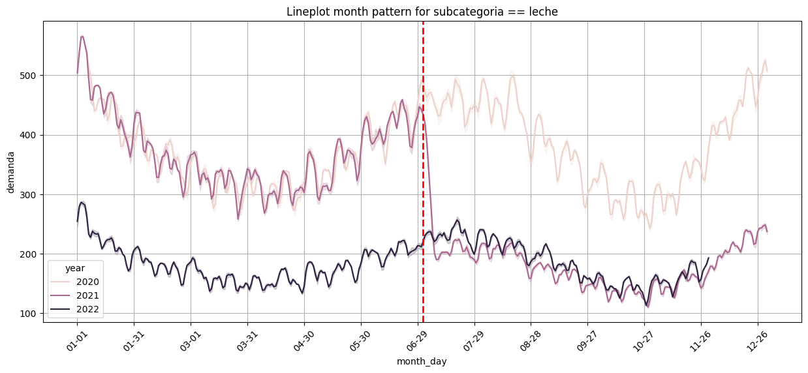

Using barplot_month_pattern, the total sales achieved per month can be seen for the specified product, category, or subcategory for the months of the years available in the database.

The graphs below show the sales patterns for seasonal products and exclusive brands. We can see a significant reduction in sales for exclusive brands, which may indicate that the competition offers a competitive product for these or even that it may have gained access to these products for sale.

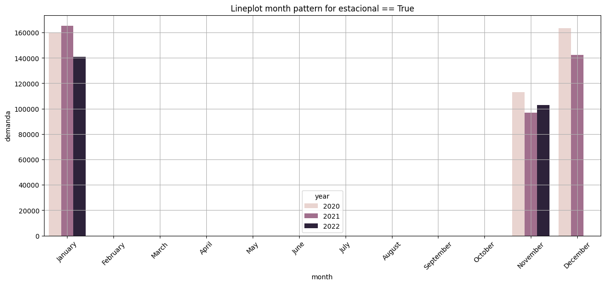
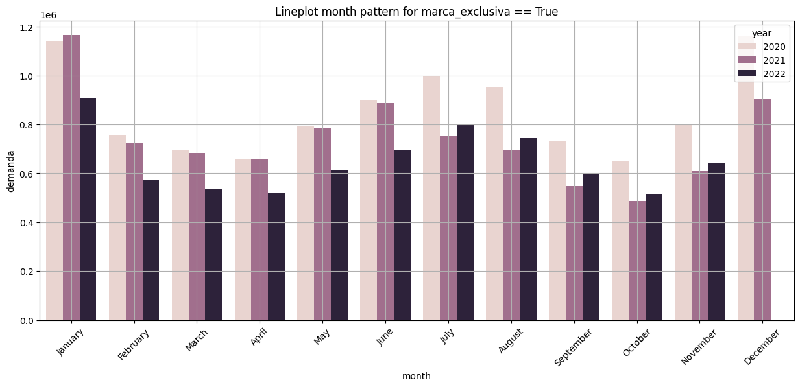

Using lineplot_weekday_pattern, the average sales pattern for the specified products throughout the days of the week for each month can be observed.

The graph shows the trend in national beer consumption throughout the week, with its minimum on Monday and peak on Sunday. Its consumption is also higher in the first and last months of the year and lower during the middle months.

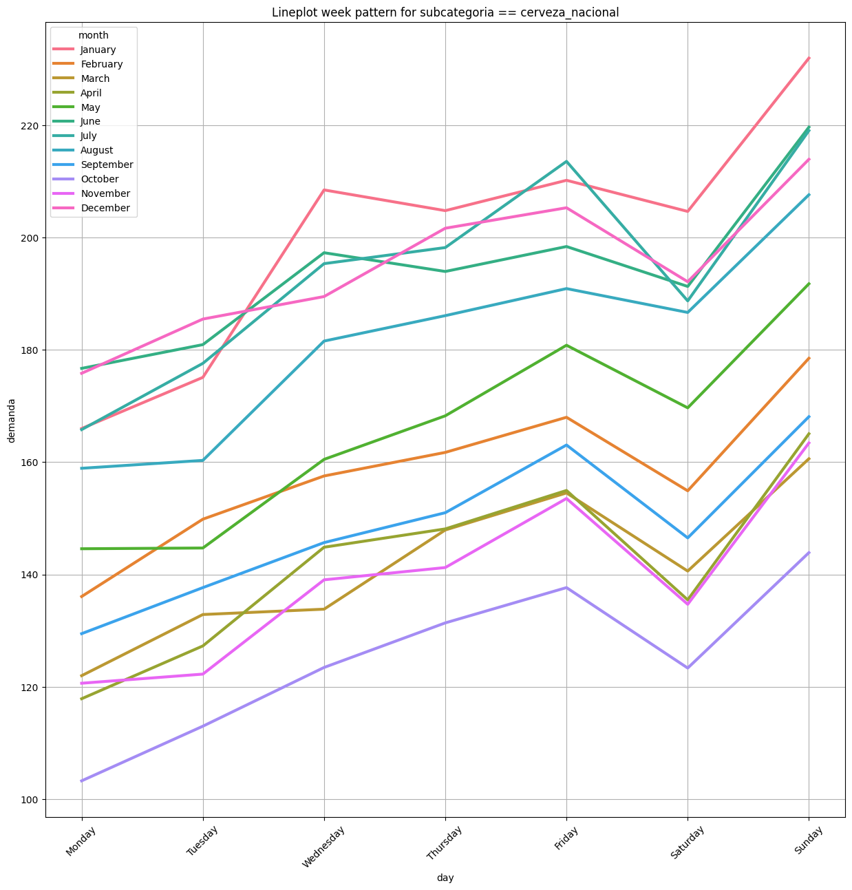

# Model

The training data (demanda.csv) was split into training (first 80% of dates) and validation (remaining 20% of dates). Different regression models were run on the training section, and their prediction results were combined into a single robust prediction using the mean.

demanda.csv contains data over a total time range of 1064 days. The first 80% (851 days) of this data will be used to train the model, and the remaining 20% (213 days) for validation.

## Linear Regression

The linear regression model that achieved the highest R-squared reached a determination coefficient of 0.506. This model considers the date, all available categorical variables, and their relationships. Additionally, this model can provide further information on the relationship between variables and demand.

From this regression, it can be determined that, keeping all variables constant, same day of the year, same product, and in the same presentation, for each passing year, there is a trend of a reduction in demand of 14 units (with 95% confidence that it varies between -19 and -10 units) daily. This result in the regression summary also shows that it is a significant value (p-value << 0.05).

```
    coef    std_err  t   P>|t| [0.025      0.975]

year -14.8473 2.493 -5.955 0.000  -19.734 -9.960
```

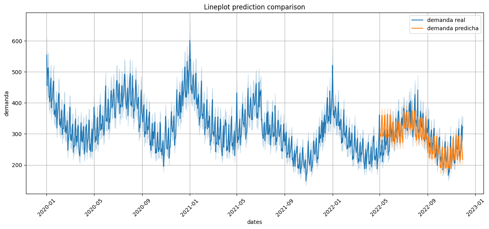

This model achieved an RMSE = 138.66 on the test data section.

## LSTM

A second model, a "Long Short Term Memory" recurrent neural network using TensorFlow, was trained, with the training data encoded using one-hot encoding. The created model has 4 layers:

- 512 neurons
- 256 neurons
- 128 neurons
- 64 neurons
- 1 output neuron with linear activation

Parameters for reducing the learning rate by half every 2 epochs without improvement in error were added, and automatic training termination after 5 epochs without improvements in the evaluation metric.

This model achieved an RMSE of 157.56.

## Final Prediction

After adjusting the hyperparameters of both models using the test set and cross-validation set, they were retrained using the entire data in demanda_test.csv. The result of this training will be used to make the final predictions on the data in demanda.csv, for which demand information is not available.

The final prediction was made considering the predictions of both the linear regression and the LSTM network, calculating the mean between the demand predicted by both models.

### Linear Regression Fit

The fit of the linear regression to the test data (rmse==138.66) looks as follows:

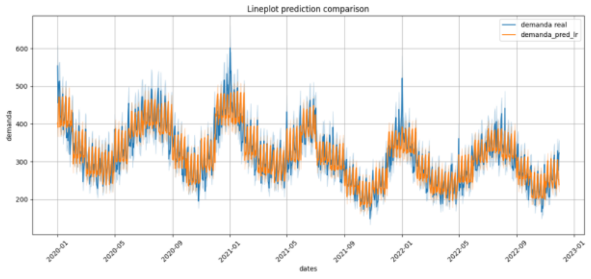

### LSTM Fit

The fit of the LSTM to the test data (rmse==133.07) looks as follows:

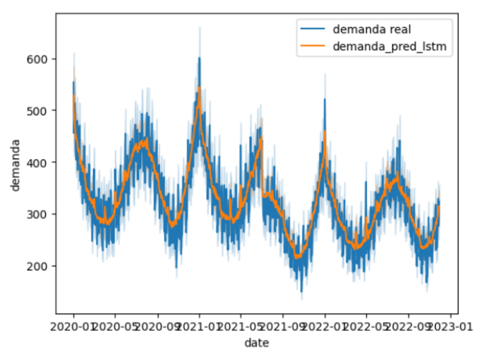

### Model Ensemble Fit

The fit of **both models** to the test data (rmse==81.14) looks as follows:

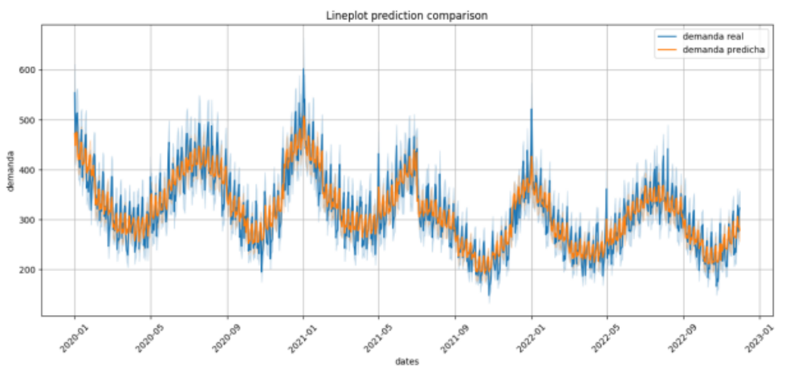

### Final Prediction

The fit of both models was used to make predictions on the data in demanda_test.csv, showing the continuity of the demand in the products as follows:

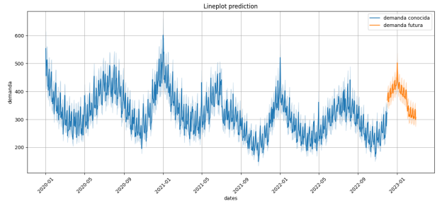

The file resultado_prueba.csv contains the predicted values for future data (date, id_producto, and demand).

Thank you very much.

Note: command to convert markdown to pdf

```
mdpdf -o README.pdf README.md
```
